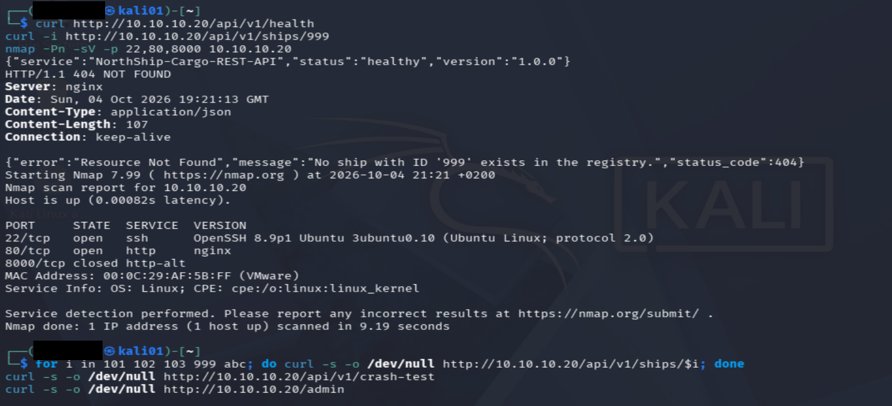
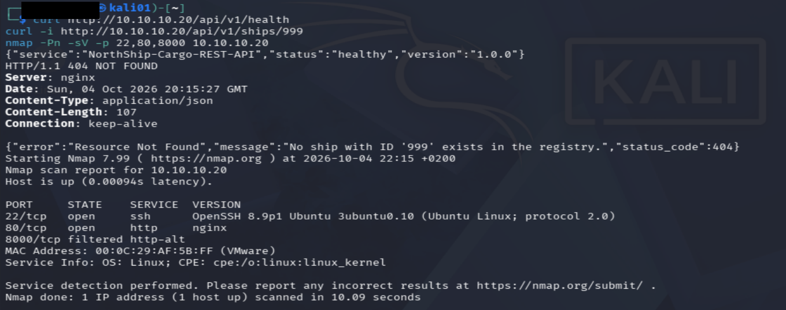
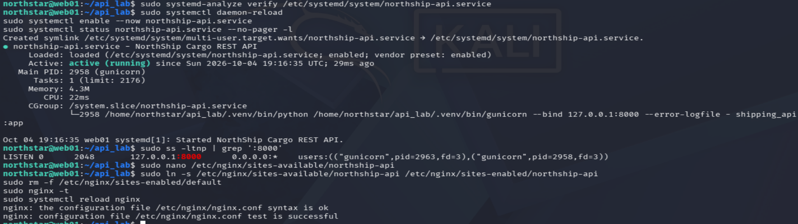
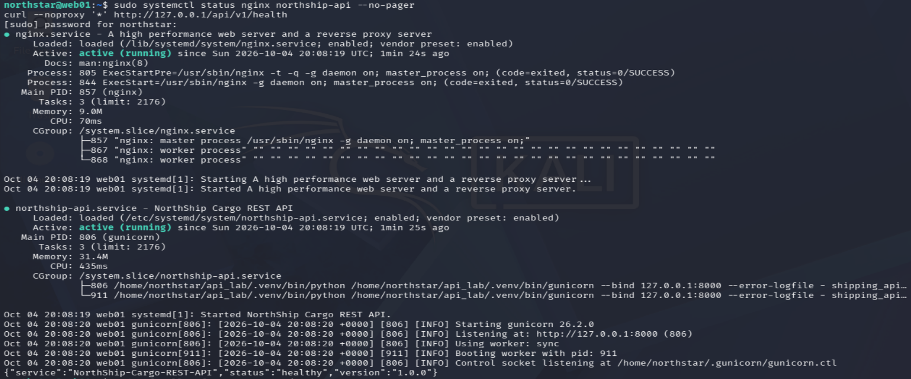
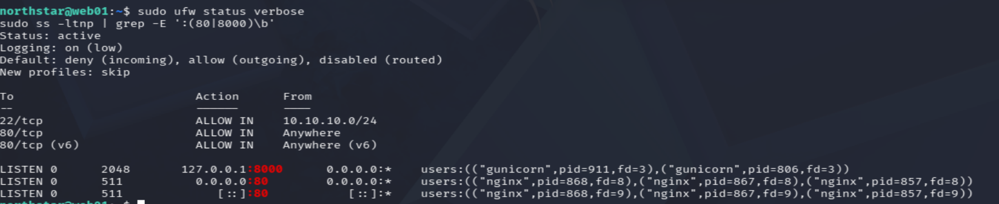
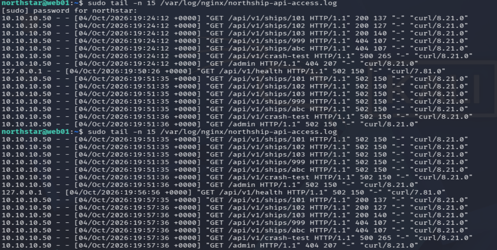

# Hardening a Flask API: Werkzeug Dev Server to Nginx + Gunicorn + systemd

**Environment:** Isolated VMware lab (Kali Linux, Ubuntu 22.04 server)
**Date:** 2026-10-04
**Author:** Eric Van Zyl

## Summary

A small Flask REST API ("NorthShip Cargo API") was running on Flask's Werkzeug development server with debug mode enabled and bound to all interfaces. I migrated it to a production-style stack: Gunicorn as the application server, Nginx as the only network-facing web service, and systemd for process management. The backend now listens on localhost only, the host firewall is enabled, and the setup survives a reboot. The Nginx access logs produced are the dataset for my `log-anomaly-detector` project.

## Environment

<table>
  <tr><th>Host</th><th>Role</th><th>Address</th></tr>
  <tr><td>web01</td><td>Ubuntu 22.04.5 LTS, API host</td><td>10.10.10.20</td></tr>
  <tr><td>kali01</td><td>Test client, Squid proxy for package downloads</td><td>10.10.10.50</td></tr>
</table>

## Starting point (risks)

The starting state is described from the original configuration and code.

- Werkzeug development server: not designed for production use
- `debug=True`: enables the interactive debugger, which can leak source code and, if the PIN is obtained, allow remote code execution
- Bound to `0.0.0.0`: reachable directly from the network
- Started manually: no automatic restart or boot persistence
- No host firewall (UFW inactive)

## Target architecture

Client -> Nginx (:80) -> Gunicorn (127.0.0.1:8000) -> Flask app

## Implementation

### 1. Package access via proxy

The server has no direct internet access, so APT and pip are routed through a Squid proxy on Kali (`10.10.10.50:3128`).

- APT: `/etc/apt/apt.conf.d/95proxies`
- pip: `--proxy http://10.10.10.50:3128`

### 2. Install Nginx and a virtual environment

```bash
sudo apt install -y nginx python3-venv
cd /home/northstar/api_lab
python3 -m venv .venv
.venv/bin/python -m pip install --proxy http://10.10.10.50:3128 gunicorn flask
```

### 3. Verify Gunicorn manually

```bash
.venv/bin/gunicorn --bind 127.0.0.1:8000 shipping_api:app
curl --noproxy '*' http://127.0.0.1:8000/api/v1/health
```

### 4. systemd service

File: `/etc/systemd/system/northship-api.service`

```ini
[Unit]
Description=NorthShip Cargo REST API
After=network.target

[Service]
Type=simple
User=northstar
Group=northstar
WorkingDirectory=/home/northstar/api_lab
ExecStart=/home/northstar/api_lab/.venv/bin/gunicorn --bind 127.0.0.1:8000 --error-logfile - shipping_api:app
Restart=on-failure
RestartSec=5
NoNewPrivileges=true
PrivateTmp=true
UMask=0027
StandardOutput=journal
StandardError=journal

[Install]
WantedBy=multi-user.target
```

### 5. Nginx reverse proxy

File: `/etc/nginx/sites-available/northship-api`

```nginx
server {
    listen 80;
    listen [::]:80;
    server_name _;
    server_tokens off;

    access_log /var/log/nginx/northship-api-access.log;
    error_log  /var/log/nginx/northship-api-error.log;

    location / {
        proxy_pass http://127.0.0.1:8000;
        proxy_http_version 1.1;
        proxy_set_header Host $host;
        proxy_set_header X-Real-IP $remote_addr;
        proxy_set_header X-Forwarded-For $proxy_add_x_forwarded_for;
        proxy_set_header X-Forwarded-Proto $scheme;
    }
}
```

The default site was removed and the configuration was validated with `nginx -t`.

### 6. Application change

The entrypoint no longer runs with debug on or binds to all interfaces:

```python
if __name__ == "__main__":
    import os
    app.run(host="127.0.0.1", port=8000, debug=os.getenv("FLASK_DEBUG") == "1")
```

Gunicorn does not execute this block. The change prevents unsafe use if the file is run directly.

### 7. Host firewall (UFW)

```bash
sudo ufw allow from 10.10.10.0/24 to any port 22 proto tcp
sudo ufw allow 80/tcp
sudo ufw enable
```

Default policy: deny incoming, allow outgoing.

## Verification

<table>
  <tr><th>Test</th><th>Result</th></tr>
  <tr><td>Health endpoint via Nginx from Kali</td><td>HTTP 200, correct JSON</td></tr>
  <tr><td>Unknown ship ID</td><td>HTTP 404, JSON error</td></tr>
  <tr><td>Gunicorn listener</td><td>127.0.0.1:8000 only</td></tr>
  <tr><td>Nmap from Kali (before UFW)</td><td>22 open, 80 open (nginx, no version), 8000 closed</td></tr>
  <tr><td>Nmap from Kali (after UFW)</td><td>22 open, 80 open (nginx, no version), 8000 filtered</td></tr>
  <tr><td>Reboot test</td><td>Nginx and northship-api active without manual action</td></tr>
</table>

## Evidence

### API verification and external scan (before UFW)


### Nmap scan after UFW was enabled


### Gunicorn service and Nginx configuration test


### Services after reboot


### UFW rules and listening ports


### Nginx access log showing backend outage and recovery


## Issues encountered

<table>
  <tr><th>Issue</th><th>Cause</th><th>Fix</th></tr>
  <tr><td>APT could not reach the internet</td><td>Wrong proxy IP (Kali is 10.10.10.50, not 10.10.10.10)</td><td>Verified with <code>ip a</code> and updated the APT proxy</td></tr>
  <tr><td>Gunicorn failed to load the app</td><td>System Gunicorn was used instead of the virtual-environment one</td><td>Used the venv path explicitly</td></tr>
  <tr><td>pip name-resolution errors</td><td>APT proxy settings do not apply to pip</td><td>Passed <code>--proxy</code> to pip</td></tr>
  <tr><td>APT lock held</td><td>unattended-upgrades was running</td><td>Waited for it to finish</td></tr>
  <tr><td>502 Bad Gateway for about 6 minutes</td><td>Syntax error introduced while editing the app, so Gunicorn could not load it</td><td>Removed the stray character and restarted the service</td></tr>
</table>

The 502 period is preserved in the Nginx log sample and shows how a backend outage appears in access logs.

## Limitations and next steps

- HTTP only, no TLS
- No explicit rate-limiting policy or application-specific request-body size limit was configured.
- Port 80 is open to any source, which is acceptable for this lab but not for production
- The intentional `/api/v1/crash-test` endpoint remains for log generation and would be removed in a real deployment
- The separate NorthShip portal (port 5000) has not been migrated yet
- Gunicorn runs a single default worker and is not tuned for performance
- Next: analyse these logs in `log-anomaly-detector`

## Skills demonstrated

Linux service management (systemd), reverse proxy configuration (Nginx), host firewalling (UFW), Python virtual environments, network verification (nmap, curl, ss), proxy-based package management, troubleshooting.
